#### Performance Testing

#### JMeter Apache GUI

## /all-student-name

### View result tree 
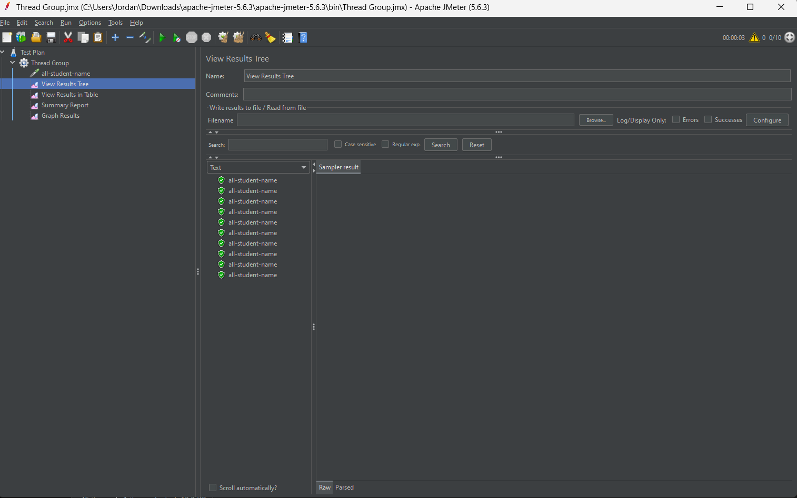

### view result table 
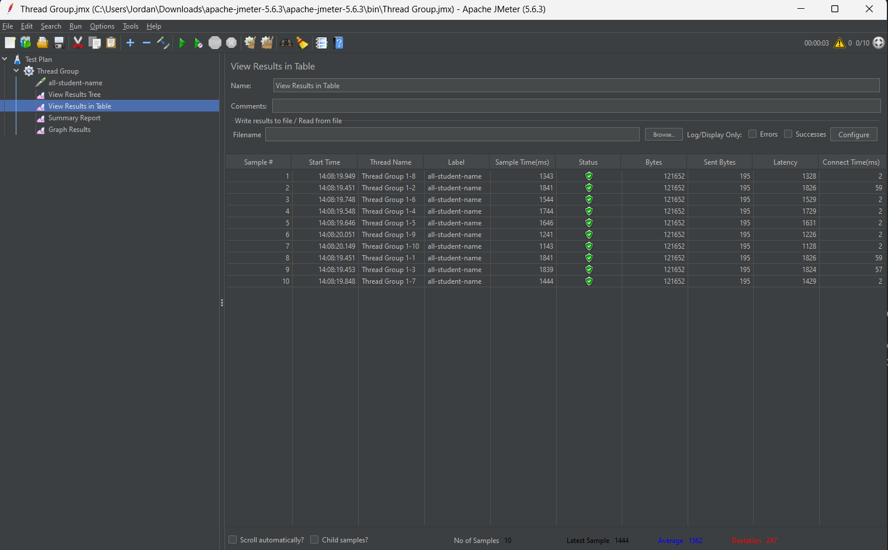

### Summary report
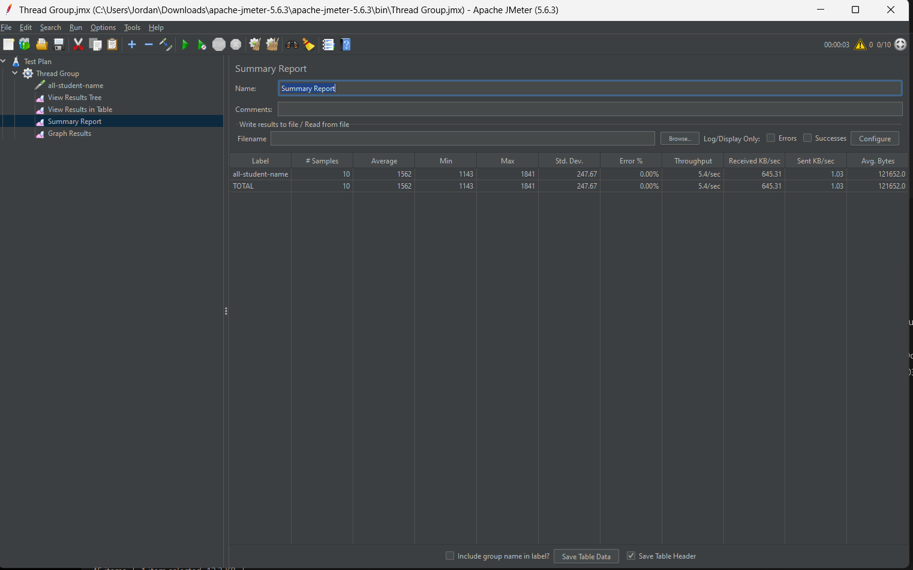

### Grapsh result
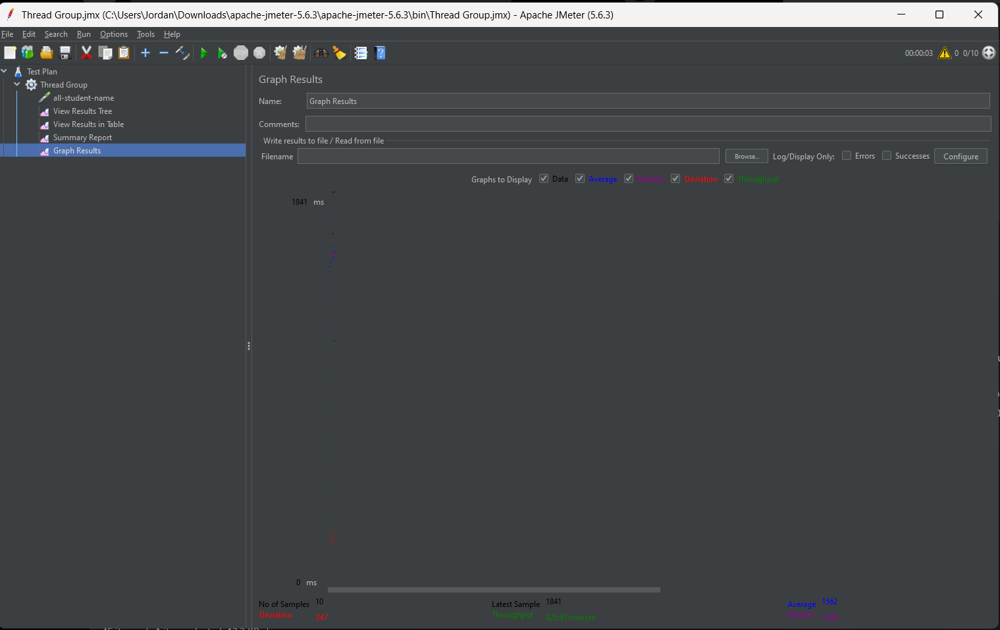

### LOG file
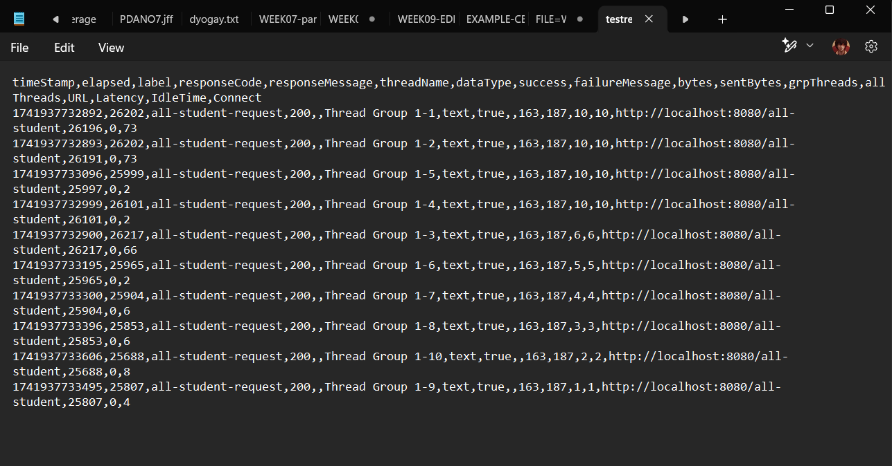

### CMD
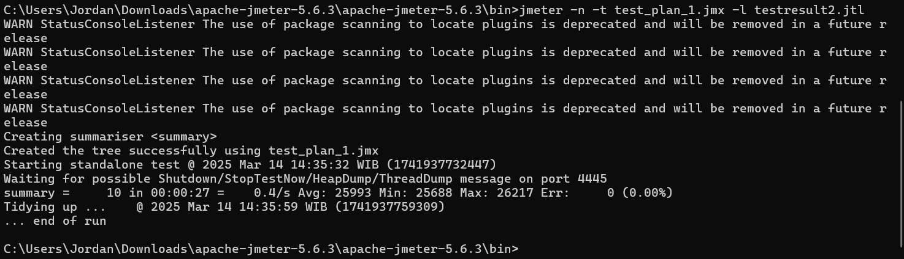

## /highest-gpa

### View result tree 
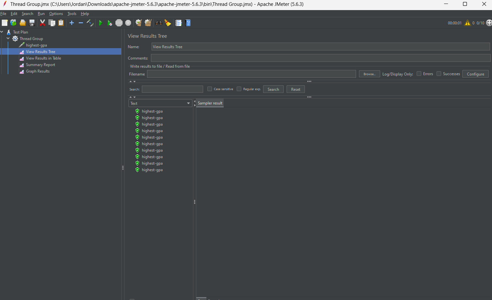

### view result table 
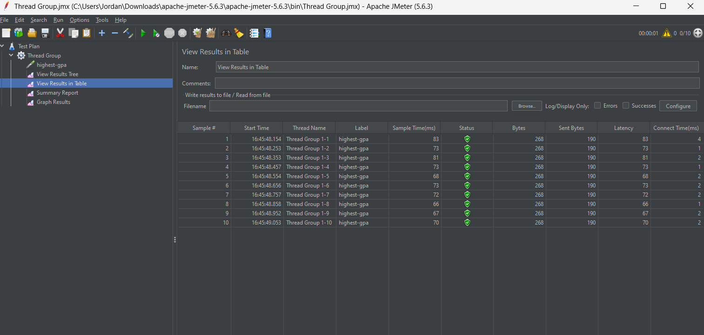

### Summary report
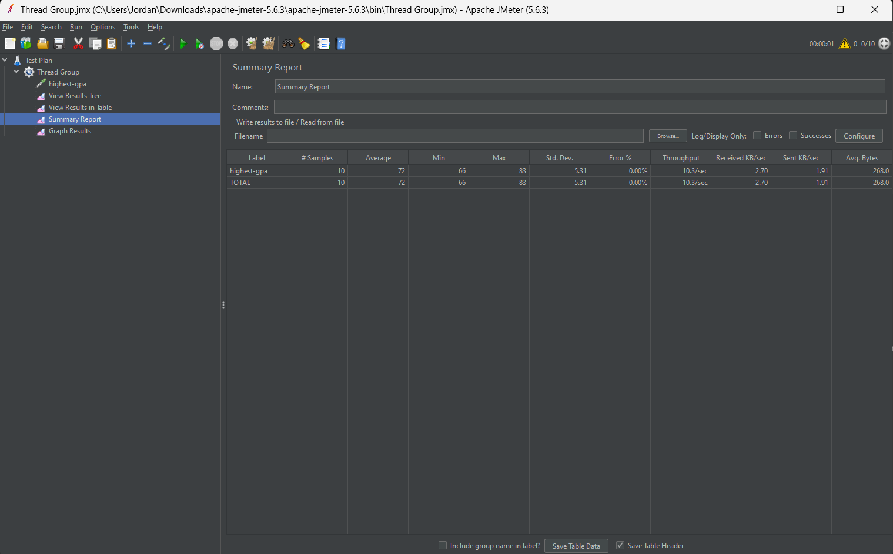

### Grapsh result
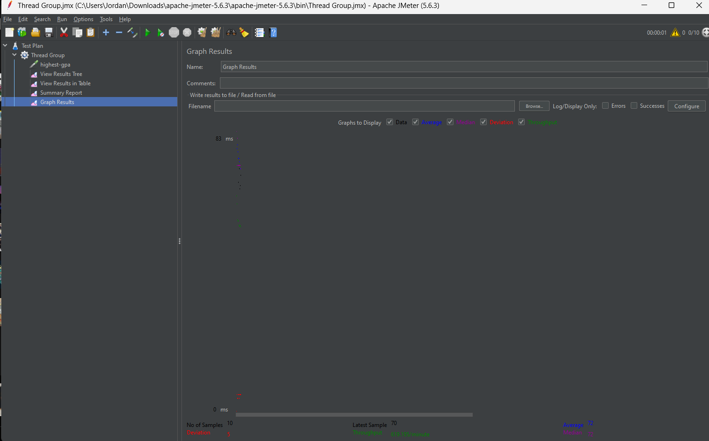

### LOG file
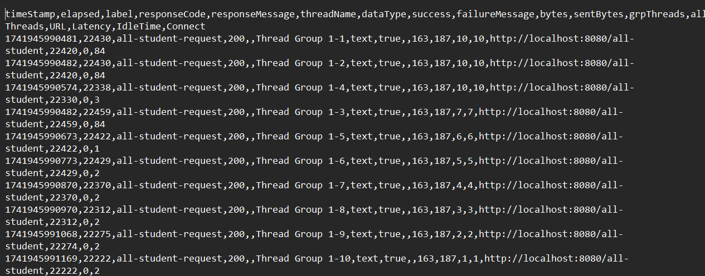

### CMD
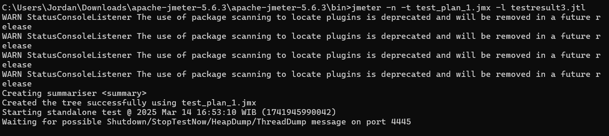

### all-student-name

### Before:
#### view result table 

#### Summary report

### After:
#### view result table 
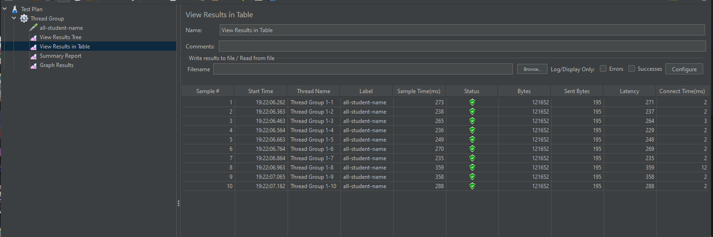

#### Summary report
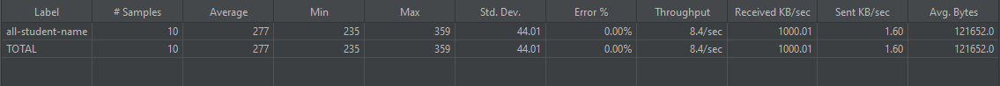

## Optimize Highest GPA

### Before:
#### view result table 

#### Summary report

### After:
#### view result table 
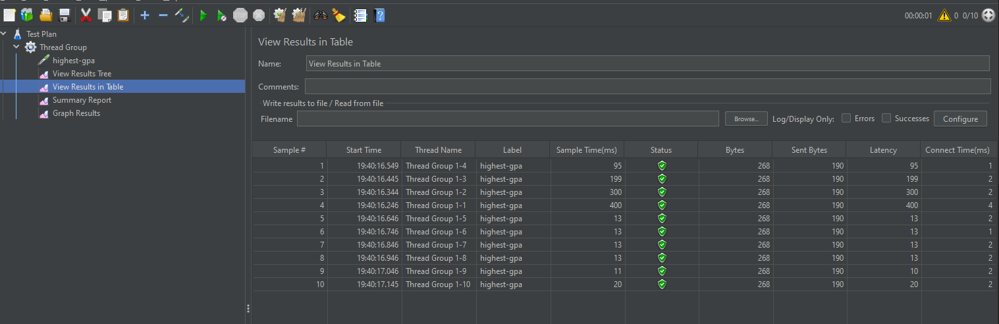

#### Summary report
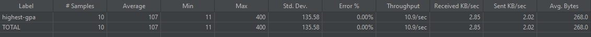

After testing we can see that aftre profiling we can see that there are imporovements. with doing these things we can get a better experinced where the app becomes more stabel and improve the amount of time that is need to run test.

### Reflection

1. What is the difference between the approach of performance testing with JMeter and profiling with IntelliJ Profiler in the context of optimizing application performance?

    Jmeter: 
    * External, black-box approach that simulates user load
    * Focuses on overall system performance metrics (response time, throughput)

    IntelliJ Profiling:
    * Focuses on specific method/class performance (CPU usage, memory allocation)
    * Analyzes runtime behavior of applications

2. How does the profiling process help you in identifying and understanding the weak points in your application?
    * Provides detailed execution statistics showing which methods consume most resources
    * Creates call trees to visualize code paths and identify inefficient algorithms
    * Measures memory allocation patterns to detect memory leaks or excessive object creation
    * Quantifies exact time spent in specific code segments
    * Shows hot spots that require optimization attention

3. Do you think IntelliJ Profiler is effective in assisting you to analyze and identify bottlenecks in your application code?
    Yes because it integrate directly witht the devalopment where we can easily test and optimze the app. other then that it also visualizes the preformance so we can tweak a code that is draineng to mush resources of the computer. 

4. What are the main challenges you face when conducting performance testing and profiling, and how do you overcome these challenges?
    * Understanding profiler output correctly
    * Avoiding performance degradation from the profiling overhead
    * Setting up representative test scenarios

5. What are the main benefits you gain from using IntelliJ Profiler for profiling your application code?
    Benefits of IntelliJ Profiler for Application Code Analysis The primary advantages I've discovered when using IntelliJ Profiler for analyzing application code performance include its seamless integration with the development environment I've been utilizing throughout my Advanced Programming coursework. The tool requires minimal setup—essentially just activating it with a single click rather than installing additional software.

6. How do you handle situations where the results from profiling with IntelliJ Profiler are not entirely consistent with findings from performance testing using JMeter?
    - Distinguish between execution metrics and response measurements
    IntelliJ Profiler primarily focuses on CPU processing time, whereas JMeter captures complete request-response cycles including network factors. When JMeter indicates performance issues despite acceptable CPU metrics in IntelliJ Profiler, I investigate potential input/output bottlenecks, memory management inefficiencies, or database query performance.

    - Evaluate code execution efficiency versus concurrent processing challenges
    While IntelliJ Profiler effectively identifies slow-performing methods, it may not fully reveal issues stemming from simultaneous request processing and resource competition.

7. What strategies do you implement in optimizing application code after analyzing results from performance testing and profiling? How do you ensure the changes you make do not affect the application's functionality?

    - Address performance issues incrementally with continuous measurement
    Rather than implementing multiple optimizations simultaneously, I focus on individual bottlenecks and quantify improvements after each change. Example: When detecting inefficient string operations in loops, I implement more efficient approaches like StringBuilder and verify performance gains before proceeding.
    
